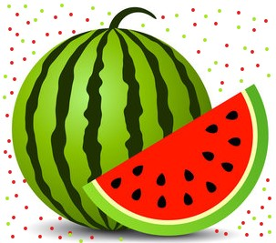

<!DOCTYPE html>

<html>
    <head>
        <title>farming form</title>
    </head>
    
    <body>
        <fieldset>  
            <form method="POST">
                <h2>
                    
                        KILIMO CHA TIKITI
                    
                </h2>
            <h3>MASWALI KUHUSU KILIMO</h3>
            <h4>UTAFITI</h4>
        </fieldset>   
            

        <fieldset>
        <ol>
            <li>Katika masoko bei ya kuuza tikiti lenye ubora</li>
                <label>Minimum:</label><input type="text">
                <label>Maximum:</label><input type="text">
            <li>Upi ni msimu bora wa kupanda matikiti, ukizingatia mabadiliko ya tabia ya nchi?</li>
                <textarea name="jibu" id="text" cols="100" rows="5">Jibu:</textarea>
            <li>Wakati wa uvunaji wa tikiti zilizo shambani, zinahitaji kuvunwa kwa awamu ngapi?</li>
                <textarea name="jibu" id="text" cols="100" rows="5">Jibu:</textarea>
            <li>Uhifadhi bora wa tikiti zilizovunwa ni upi, na unahusianaje na kikonyo chake, na muda gani?</li>
                 <textarea name="jibu" id="text" cols="100" rows="5">Jibu:</textarea>
            <li>Kutoka Kangeta kilimo, tunaweza kupata mahitaji yafuatayo kwa ardhi ekari moja?
            

                Mbegu,Mbolea,Dawa,Mitego ya wadudu,Dripping
            

                <textarea name="jibu" id="text" cols="100" rows="5">Jibu:</textarea>
            </li>
            <li>Je ni namna gani ya kuweka uhusiano mzuri baina ya vifuatavyo; 
                 -kipindi cha kutoa maua 
                 -nyuki 
                 -dawa za wadudu
            </li>
                <textarea name="jibu" id="text" cols="100" rows="5">Jibu:</textarea>
            <li>Je, busta zote ni muhimu kupiga? kipindi cha mimea michanga, maua, matunda?</li>
                <textarea name="jibu" id="text" cols="100" rows="5">Jibu:</textarea>
            <li>Kipindi gani cha ukuaji wa tikiti kina changamoto nyingi zaidi na kinahitaji uangalizi wa karibu zaidi?</li>
                <textarea name="jibu" id="text" cols="100" rows="5">Jibu:</textarea>
            <li>Baada ya kujua historia ya shamba, je unaweza kurudia kupanda tikiti katika ardhi ambayo tikiti limeshapandwa msimu wa nyuma? </li>
                <textarea name="jibu" id="text" cols="100" rows="5">Jibu:</textarea>
            <li>Ni mbolea ipi ungependekeza zaidi kutumika wakati wa kupanda kwa matokeo bora zaidi?</li>
        

            <input type="radio" name="mbolea">Samadi
            <input type="radio" name="mbolea">DAP
                <textarea name="jibu" id="text" cols="50" rows="3">Maelezo ya ziada:</textarea>
        

            <li>Nafasi kutoka mmea mmoja kwenda mmea mwingine,shina moja kwenda shina jingine, ni kiasi gani bora zaidi?</li>
                <textarea name="jibu" id="text" cols="100" rows="5"></textarea>
            <li>Aina gani ya mbegu ni bora, huleta matunda makubwa na matamu?</li>
                <textarea name="jibu" id="text" cols="100" rows="5">Jibu:</textarea>
            <li>Je kwa herari moja inaweza hitaji wafanyakazi wangapi, na malipo yao kwa makadirio inaweza kuwa kiasi gani?</li>
                <textarea name="jibu" id="text" cols="100" rows="5">Jibu:</textarea>
            <li>Je unafahamu shamba au sehemu wanakodisha mashamba kwa bei nzuri na kuna chanzo cha maji?</li>
                <textarea name="jibu" id="text" cols="100" rows="5">Jibu:</textarea>
        </ol>
            

                Bonyeza hapa kuwasilisha >>> <input type="SUBMIT" name="SUBMIT">
            

            <footer>
                Asante kwa ushirikiano wako, na Mungu akubariki sana.  
                &copy; 2023 Watermellon Project (Carl vs Rio)
            </footer>
        </form>
    </fieldset>
    </body>
</html>
